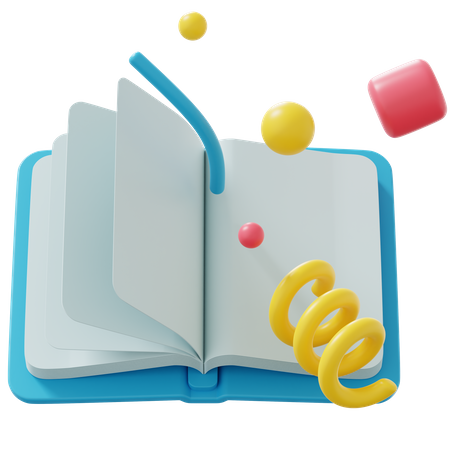

# PQ Hub

### What is PQ Hub?
PQ Hub, short for Past Questions Hub, is a project designed to address a common challenge faced by students. We understand the persistent challenge students face when it comes to finding and sharing past questions for exam preparations. That's why we're dedicated to eliminating the hassle and bringing past questions right to your fingertips.

### Meet Aman Kumar
Hello there! I'm Aman Tiwari, but you might know me better as Sid. I'm currently pursuing a B.tech (CSE) Computer Science Engineering at KJ Somaiya (Mumbai). As a web developer, I'm deeply passionate about leveraging my coding skills to tackle real-world challenges.

### Inspiration Behind PQ Hub
The inspiration for PQ Hub came from personal experience. As a student myself, along with my friends, I often found ourselves scrambling to gather past questions for exam preparations. Recognizing the universal nature of this challenge, I embarked on a mission to create a solution that would streamline the process for students.

## Key Features

- **Share Past Questions**: PQ Hub allows students to share and explore past questions effortlessly. Our platform provides a centralized hub where students can easily share and access past questions with fellow peers.
  
- **Real-time Chat**: Engage in meaningful discussions with friends about studies, exams, and more with our real-time chat feature. Connect with other students, exchange insights, and support each other's academic journeys.

- **AI Assistance**: Stuck on a challenging question? Our AI chatbot is here to help! Get instant assistance and guidance on difficult questions, allowing you to overcome obstacles and excel in your studies.

- **Earn Rewards**: Earn points by sharing past questions and engaging with the PQ Hub community. Redeem your accumulated points for airtime or data rewards, giving you the opportunity to stay connected while you study.

- **Social Networking**: PQ Hub isn't just about past questions—it's also a social networking platform for students. Connect with friends, follow each other, like posts, and bookmark past questions for later reference.

- **User-friendly Experience**: We've designed PQ Hub to be user-friendly, fast, and responsive across all devices. Whether you're accessing our platform on your laptop, tablet, or smartphone, you'll enjoy a seamless experience that prioritizes ease of use and accessibility.

## Technologies Used

PQ Hub is powered by cutting-edge technologies to deliver a seamless user experience.

- **Frontend**: Developed using [React](https://react.dev) and styled with [Tailwind CSS](https://tailwindcss.com) for a sleek and modern look.
  
- **Backend**: Powered by [Firebase](https://firebase.com), ensuring robust performance and seamless data management.

- **Libraries**: We've integrated additional libraries such as [MUI](https://mui.com) for intuitive UI, [React-Select](https://react-select.com) for dropdowns and [React-Hot-Toast](https://react-hot-toast.com) for user-friendly notifications.

- **Development Tools**: Built with [Vite](https://vite.com) for rapid development and efficient maintenance.

## Future Plans

Our journey with PQ Hub doesn't end here. We're committed to continuous improvement and innovation.

- **Mobile App Development**: We're working on developing a mobile app for both iOS and Android platforms, allowing students to access PQ Hub on the go.
  
- **AI Integration**: We're on a mission to make studying even smarter with AI image recognition. Say goodbye to spammy posts and hello to a cleaner, more helpful study feed!

## Contact

Got questions, feedback, or just want to say hi? We'd love to hear from you!

- **Email**: [logicaman20@gmail.com](mailto:logicaman20@gmail.com)
- **Phone**: +917667849533

**Address**:
India, Mumbai
Goregaon
Aarey Colony
Royal Palms

## Follow Us

- [GitHub](https://github.com/mnn2003)
- [WhatsApp](https://wa.me/917667849533)
- [Instagram](https://www.instagram.com/mnn_2003/)
- [Twitter](https://twitter.com/logicxsid)

Proudly founded by @mnn2003  
© All rights reserved 2024
